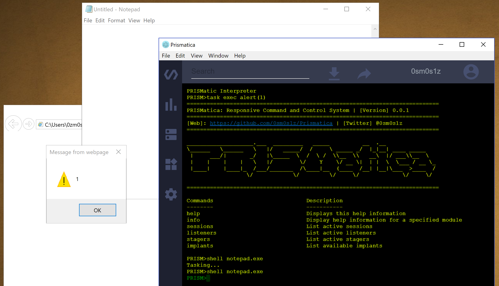

# Prismatica (In Development)

Prismatica is a modular C2 Interface hooked into the Diagon Command and Control Toolkit. 

                                          - ........................................
                                          - ........................................
                                          - ........M...............................
                                          - ......N......................... .Z.....
                                          - .....M.......... M++M..........MMMN.....
                                          - ....MMMM......M?======$M .....MMDM......
                                          - ...,...MMD.MM=====IM=====MM  M..........
                                          - ..D .....M=======M..8=======M ..........
                                          - .M ....M====+===+...DMM==NM===M.........
                                          - . .....M==+..MM. ..MMMMMM.MM==M.........
                                          - Z......M==M..MMM..NMMMMMMN.MM=M.........
                                          - .......M=M MMMMM..MMMMMMMMMMMMM.........
                                          - .......MMMMMMMMMMMMMMMMMMMMMMMM.........
                                          - ..... .MMMMMMMMMMMMMMMMMMMMMMMM.........
                                          - .......MMMM  BLACK HILLS   MMMM.........
                                          - .......MMMM    INFOSEC     MMMM.........
                                          - ........MMMMMMMMMMMMMMMMMMMMMM .........
                                          - .........MMMMM B H I S MMNMMMMM.........
                                          - ..... M:. ..MMMMMMMMMMMMMM....MM$.......
                                          - ....MM........+MMMMMMMM.........MM .....
                                          - .................MMMM...................
                                          - ........................................
                                          - ........................................
                                          - ........................................
